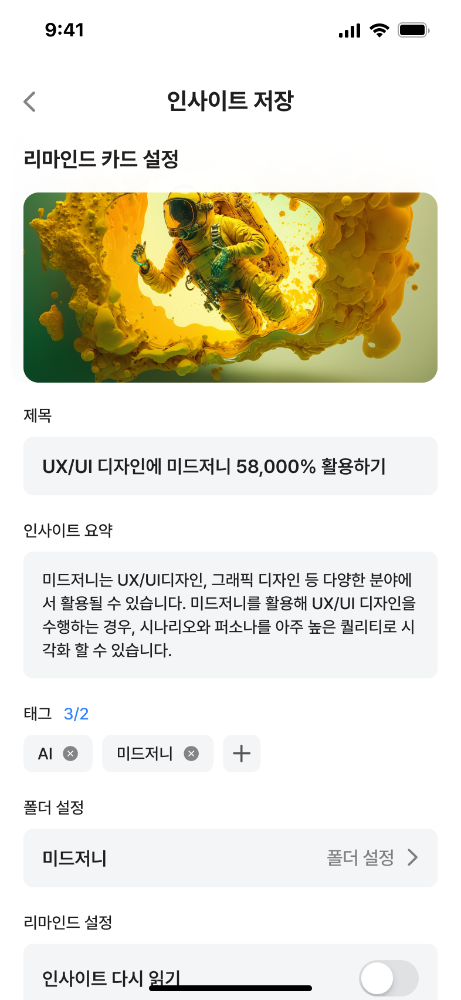
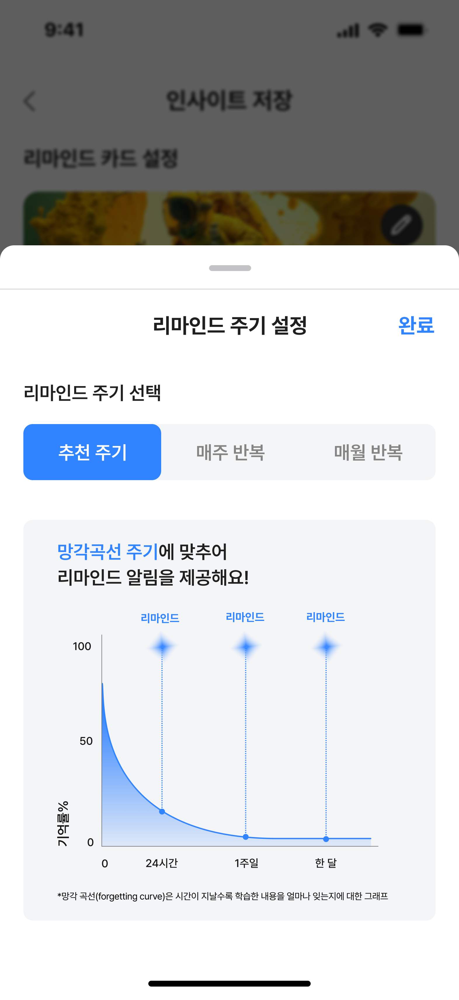

<div align="center">

<svg width="606" height="117" viewBox="0 0 606 117" fill="none" xmlns="http://www.w3.org/2000/svg">
<path d="M20.4936 102.424H0V5.69141H49.7104C53.7325 5.69141 57.8416 6.08653 62.0379 6.8588C66.2341 7.64904 70.0821 8.99604 73.5644 10.9357C77.0467 12.8754 79.8848 15.4257 82.0787 18.6046C84.2726 21.7835 85.3521 25.8066 85.3521 30.6917C85.3521 33.8167 84.5512 36.5826 82.9493 38.9892C81.3474 41.3779 79.3102 43.4073 76.8552 45.0776C74.4002 46.7299 71.7013 47.9871 68.7414 48.8133C65.7988 49.6395 63.0303 50.0525 60.436 50.0525H74.8006C80.6335 50.0525 85.3521 54.9197 85.3521 60.9363V102.424H63.3786V68.5693H20.4936V102.424ZM20.4936 24.4955V50.0705H49.5711C53.5932 50.0705 56.9536 49.0109 59.6873 46.8916C62.4035 44.7723 63.779 41.5036 63.779 37.0854C63.779 32.6673 62.4557 29.2369 59.8266 27.3332C57.1974 25.4474 53.8195 24.4955 49.7104 24.4955H20.4936Z" fill="#4991FF"/>
<path d="M187.774 5.69141H207.69V102.424H187.774V5.69141Z" fill="#4991FF"/>
<path d="M219.07 102.424V5.69141H239.47V102.406H219.07V102.424ZM310.113 5.69141V102.406H268.647L239.47 5.69141H260.536L289.713 102.406V5.69141H310.113Z" fill="#4991FF"/>
<path d="M342.156 102.424H321.493V5.69141H377.547C382.41 5.69141 386.816 6.4815 390.783 8.04373C394.751 9.60595 398.121 11.7967 400.913 14.6159C403.704 17.435 405.863 20.8109 407.391 24.7793C408.918 28.7477 409.69 33.1651 409.69 38.0493C409.69 43.2028 408.655 47.674 406.583 51.4449C404.512 55.2158 401.791 58.3403 398.42 60.7644C395.049 63.2065 391.187 65.0201 386.869 66.2232C382.55 67.4263 378.126 68.0189 373.632 68.0189H342.156V102.424ZM342.156 49.2183H373.632C378.231 49.2183 381.743 48.3384 384.165 46.5966C386.588 44.8548 387.817 41.9997 387.817 38.0313C387.817 33.0573 386.482 29.5558 383.832 27.5267C381.181 25.4976 377.547 24.492 372.965 24.492H342.173V49.2183H342.156Z" fill="#4991FF"/>
<path d="M418.243 65.1099V5.69141H438.914V63.7272C438.914 67.965 439.616 71.3229 441.004 73.8189C442.391 76.3148 444.323 78.1644 446.747 79.4213C449.17 80.6783 451.998 81.4504 455.194 81.7737C458.39 82.0969 461.745 82.2585 465.257 82.2585C468.769 82.2585 468.84 82.0969 472.036 81.7737C475.232 81.4504 478.077 80.6604 480.554 79.4213C483.03 78.1823 484.997 76.3148 486.437 73.8189C487.877 71.3409 488.597 67.965 488.597 63.7272V5.69141H509.268V65.1099C509.268 72.8492 507.986 79.134 505.422 83.9644C502.858 88.7947 499.38 92.5836 495.007 95.295C490.634 98.0065 485.594 99.874 479.869 100.897C474.144 101.921 471.474 102.424 465.257 102.424C459.04 102.424 453.104 101.921 447.414 100.897C441.741 99.8919 436.736 97.9885 432.416 95.2411C428.096 92.4758 424.653 88.669 422.072 83.8387C419.508 79.0083 418.226 72.7594 418.226 65.1099H418.243Z" fill="#4991FF"/>
<path d="M605.982 5.69141V25.318H572.191V102.424H551.594V25.318H517.803V5.69141H606H605.982Z" fill="#4991FF"/>
<path d="M129.864 105.268C124.958 105.268 120.14 104.725 115.502 103.465C105.545 100.736 98.8118 94.0694 96.5375 84.7259C94.3885 75.8373 96.7165 65.5139 102.286 57.4827C101.605 56.9403 100.979 56.3454 100.388 55.7505C96.7524 52.0586 92.7409 45.3746 94.1915 34.4214C98.1134 4.93855 131.333 -2.25281 158.607 0.564242C162.547 0.966678 165.394 4.41363 164.982 8.26302C164.57 12.1124 161.042 14.8945 157.103 14.492C152.482 14.0196 111.813 10.5727 108.411 36.2061C107.533 42.785 109.933 45.2346 110.721 46.0395C111.15 46.4769 111.706 46.9494 112.458 47.4218C123.865 38.6382 142.4 28.3498 157.3 32.0067C164.284 33.7215 169.298 38.5157 170.355 44.5173C171.34 50.0814 168.653 55.523 163.191 59.0749C157.067 63.0643 149.33 64.0442 141.952 64.6916C131.351 65.6364 122.558 65.269 115.502 63.5892C111.258 68.5584 109.145 75.8198 110.524 81.4889C111.58 85.8457 114.481 88.6277 119.424 89.975C133.661 93.8769 152.178 88.2778 166.719 82.9586C170.426 81.5939 174.563 83.4486 175.942 87.053C177.321 90.6749 175.44 94.6993 171.751 96.0641C159.377 100.578 144.334 105.25 129.936 105.25L129.864 105.268ZM150.53 45.2171C145.283 45.2171 138.675 47.6318 132.192 51.2012C134.717 51.1662 137.529 51.0437 140.645 50.7638C144.746 50.3963 151.623 49.8014 155.222 47.4393C155.652 47.1593 155.921 46.9144 156.082 46.7569C155.795 46.4419 155.097 45.8995 153.79 45.5846C152.787 45.3396 151.694 45.2171 150.53 45.2171Z" fill="#4991FF"/>
<path d="M163.574 116.646C159.846 116.646 156.76 113.729 156.639 110.045C156.431 103.733 159.794 97.2169 163.262 92.2018C156.327 89.1143 149.842 84.7645 148.056 83.5363C144.918 81.3699 144.155 77.1224 146.357 74.0349C148.559 70.9474 152.876 70.1968 156.015 72.3632C162.482 76.8154 171.723 81.7111 175.381 81.8305C178.121 81.9157 180.566 83.6045 181.589 86.1121C182.612 88.6196 182.022 91.4854 180.097 93.43C176.144 97.4216 170.371 105.32 170.509 109.618C170.631 113.388 167.631 116.527 163.799 116.646C163.73 116.646 163.643 116.646 163.574 116.646Z" fill="#4991FF"/>
</svg>

[](https://hits.seeyoufarm.com)

</div>

# REINPUT

> 끊임없이 성장을 추구하는 PM, 디자이너, 개발자를 위한 서비스. ✔️
> <br>
> 파편화된 인사이트를 리인풋이 제공하는 One-Stop 분류 서비스로 체계적으로 관리하고,<br>
> 리마인드 기능을 통해 인사이트를 주기적으로 상기시켜 소중한 인사이트를 활용해 보세요 !

## 배포 주소

> [2024-beotkkotthon-team-24-fe.vercel.app](2024-beotkkotthon-team-24-fe.vercel.app)

## 프로젝트 소개

### 아웃풋을 위한 인풋

성장을 추구하는 우리 모두는 커리어 개발을 위해
다양한 채널에서 수많은 콘텐츠를 소비합니다.

산발적으로 흩어져 있던 인사이트를 체계적으로 관리하고,
소중한 인사이트를 필요할 때 활용할 수 있도록
능동적이고 창의적인 리마인드 문화를 만듭니다.

1. 인사이트를 아카이빙하는 고객에게
2. 인사이트를 잊지 않도록
3. 효율적인 분류 기능과 리마인드 기능을 제공하는 서비스

## 데모

1. `main` 브랜치에서 코드 복사

```
git clone https://github.com/goormthon-Univ/2024_BEOTKKOTTHON_TEAM_24_FE.git
```

2. dependency 설치

```
pnpm i
```

3. 프로젝트 빌드

```
pnpm build
```

4. 코드 실행

```
pnpm run dev
```

## 주요 기능

- One-Stop 자동화 아카이빙 서비스
  - 인사이트 입력 시 자동으로 폴더 분류
  - 인사이트 자동 요약 및 태그 분류
  - 이미지, 메모, 출처 입력 가능
- 리마인드 알림 제공
  - 망각곡선 주기 맞춤 리마인드를 알림 제공
  - 리마인드 주기 맞춤화 가능
- 리마인드 질문
  - 리마인드 질문 및 답변 기능 제공
- 인사이트 추천
  - 홈 화면에서 매일 직무별 인사이트 추천
  - 저장한 인사이트 기반 같은 태그 인사이트 추천

## 개발 환경

- Front-end: Next.js, TypeScript, Zustand, styled-component, framer-motion, next-pwa, tanstack/react-query

## 동작 화면

### 온보딩 화면

| --                       | --                       | --                       |
| ------------------------ | ------------------------ | ------------------------ |
|    |  |  |
|  |  |  |

### 홈 화면


### 저장 화면





